<p align="center">

</p>
<h1 align="center">肇新智慧物业</h1>
<p align="center">


</p>

## 简介

​        《肇新智慧物业》是一个免费开源的基于java的物业管理系统。未来将涵盖停车、安保、客服、工单、收费、财务、办公自动化等模块，构建一个软硬件一体的智慧物业解决方案。已开发的功能模块请参考**功能介绍**

## 产品蓝图
<p align="center">

</p>

## 功能介绍（v0.10.1） 
系统内置功能： 

- 资产管理
  商业区管理、楼栋管理、商铺管理、商铺租售
- 缴费数据管理
  商铺绑定费用、自动生成费用、手动生成费用
- 缴费服务
  缴费数据管理、日常缴费、与收费、临时收费、收款凭证打印
- 退款功能
  常规收费项退款（支持分批多次退款，支持部分退款）、押金退款、临时收费退款
- 缴费提醒
  费用到期提醒、欠费提醒
- 抄表功能
  抄表数据导入、抄表数据生成费用
- 打印功能
  灵活可扩展，支持连打、套打，支持无预览打印等场景
- 统计报表
  日收费报表、商铺租售比例统计、费用汇总表等
- 协同办公
  报修流程、投诉流程、流程设计器

## 物业收费
功能特点：
| <div style="width:100px">功能</div> | <div style="width:400px">描述</div> |
| --- | --- |
| 自定义收费项 |支持固定收费、临时收费、预收费功能，支持复杂动态费用、梯度费用 |
| 自动生成账单 | 根据收费项规则自动计算账单周期和费用。支持批量生成账单、滞纳金计算、缴费优惠的设置 |
| 专业打印 | 支持无预览连打、套打等场景。支持多页打印分页数据汇总。适配商业场景 |
| 费用催收 | 预留短信催收接口，支持催收数据下载和在线打印方便线下催收 |
| 租控图 | 直观把控商铺租售状态 |

### 收费项类型说明
| 类型  |关联商铺| 功能特点 | 常见的费用  |
| -------------- |---- |------------------------------------------------ |----------------|
| 常规收费项  | 必须 | 周期性付费、自动费用计算、部分全额退款、欠费提醒、可关联抄表数据、可收取滞纳金、支持预收 | 水费、电费、物业费、停车费等周期性计划性的收费 |
| 临时收费项  | 非必须 | 支持收费和退还、支持非业主的收费，用于非周期类收费 | 维修费、罚款、广告收费等非计划性的收费 |
| 押金类收费项 | 非必须 | 支持收费和退还，一般是必须要退还的| 各种押金收费 |

### 自定义复杂收费项
```
公式使用说明

公式变量： 单价 数量

语法逻辑处理函数： if elsif else return

以设置梯度电价为例： 230度以内0.5283元/度，231-400度 0.5783元/度，400度以上 0.8783元/度

示例公式如下：

if(数量<=230){
	return 0.5283*数量;
}elsif(数量<=400){
	return 0.5783*数量;
}else{
	return 0.8783*数量;
}

```

### 收费功能使用流程(版本有点旧了，暂时没时间更新)

http://zhaoxinms.com:81/#/manual/demoData

### 租控图
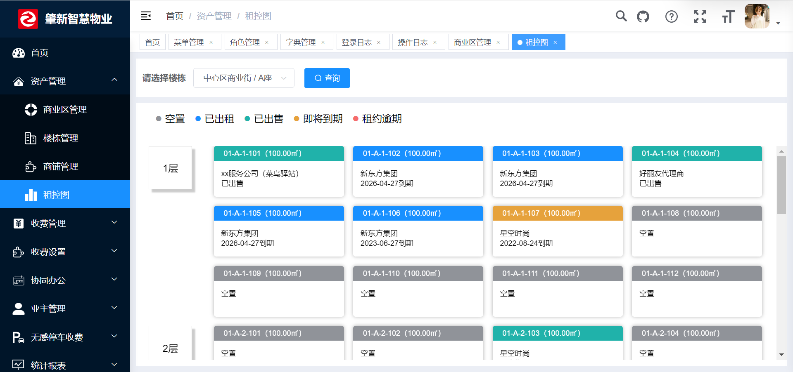

### 收费打印
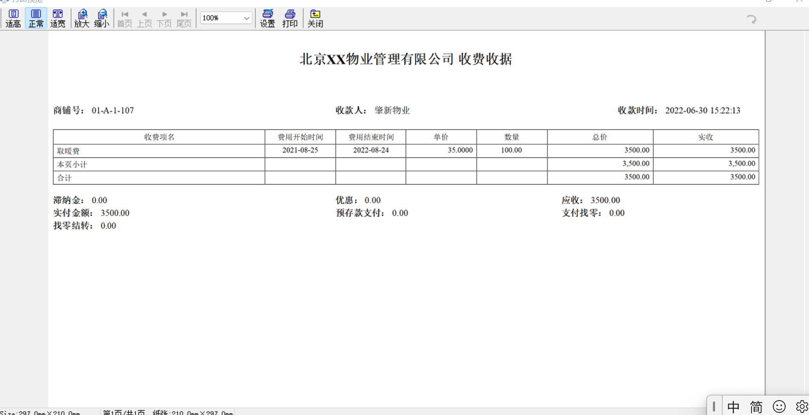

## 协同办公模块
协同办公中的维修工单处理流程
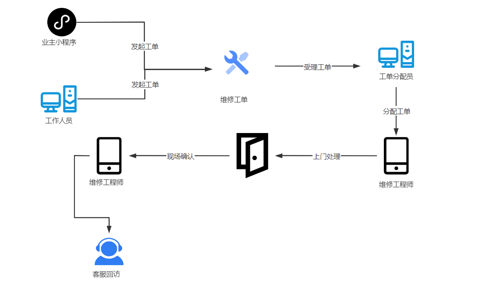

### 功能介绍
| <div style="width:100px">功能</div> | <div style="width:400px">描述</div> |
| --- | --- |
| 流程模型设计 |基于activiti独立开发了流程设计器，仿钉钉的风格 |
| 用户分组 | 基于系统的用户角色实现用户分组（可切换为部门或者岗位） |
| 待办任务 | 查看自己【未】审批的工作任务，办理、转发、委派等操作 |
| 已办任务 | 查看自己【已】审批的工作任务 |
| 工单编号 | 工作流中添加工单编号 |
| 报修工单 | 流程示例：业主可以通过小程序在线预约物业公司的维修服务。维修单以工单的形式在后台流转，维修人员可以在手机端跟踪和完成工单，从业主提出维修需求到维修完成客服回访，所有重要信息，都记录在案，形成物业公司的维修台账，提高维修服务质量管控。|
| 投诉工单 | 同上|
| 未开源部分|流程的高级特性、对接企业微信、移动端发起流程和审批流程等|

### 仿钉钉流程设计图
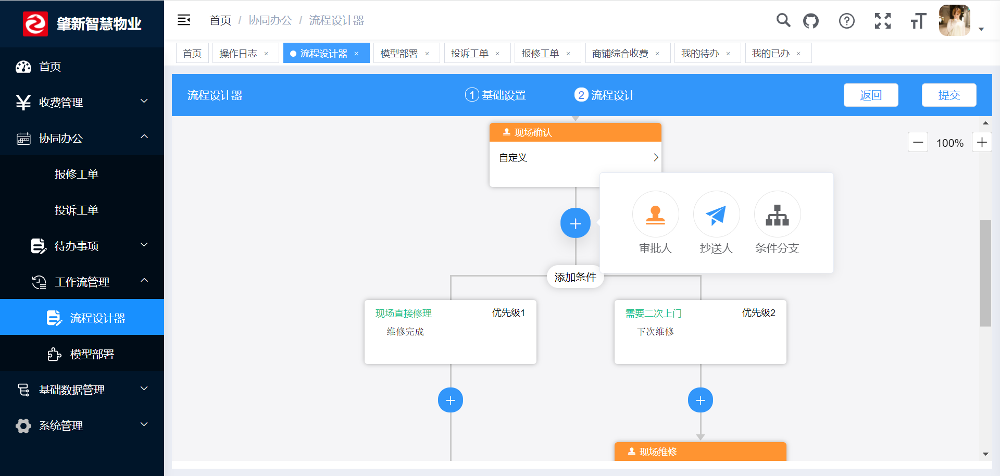

### 流程列表
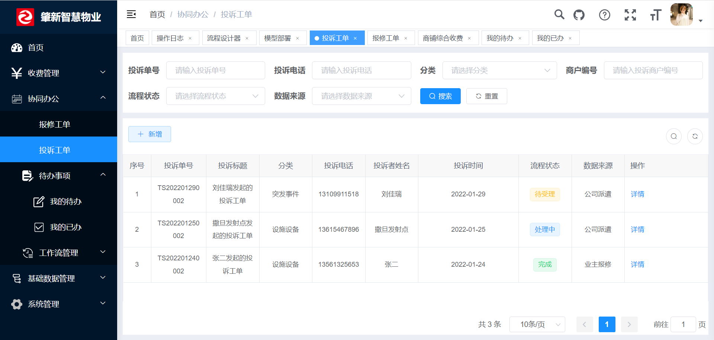

### 流程分配图
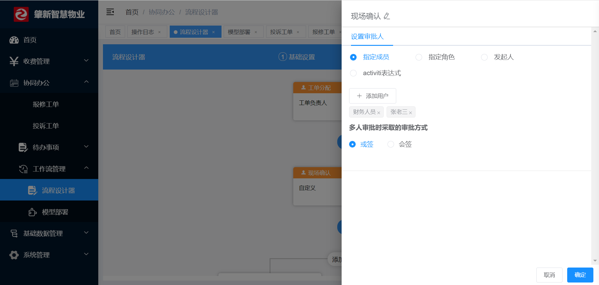

### 流程运行图
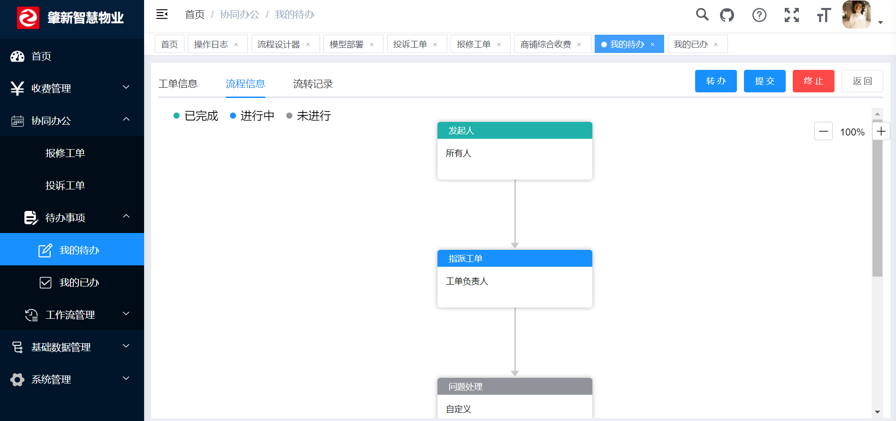

### 流程执行记录
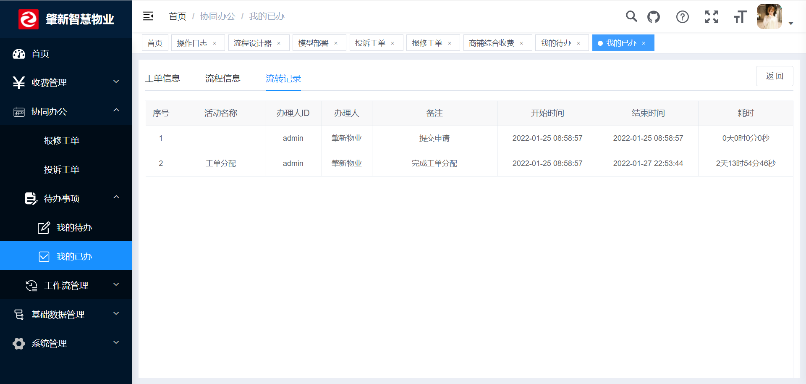

### 企业微信图
<table>
<tr>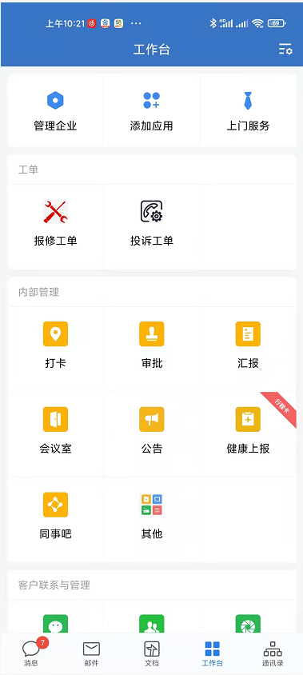</tr><tr>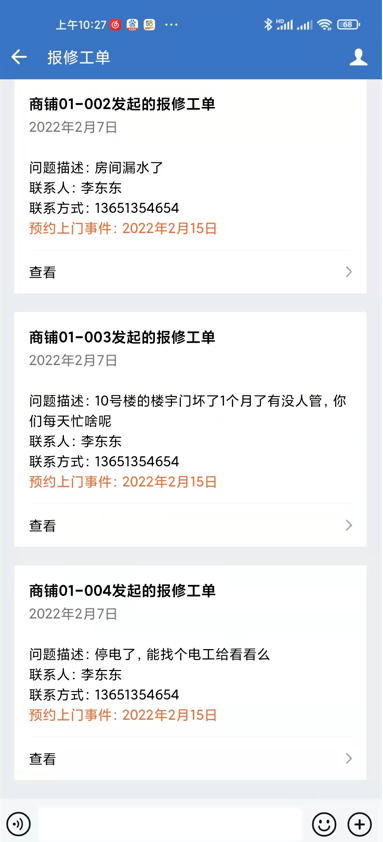</tr>
</table>


## 如何运行

### 后端运行

```
1、导入到Eclipse，菜单 File -> Import，然后选择 Maven -> Existing Maven Projects，点击 Next> 按钮，选择工作目录，然后点击 Finish 按钮，即可成功导入。
Eclipse会自动加载Maven依赖包，初次加载会比较慢（根据自身网络情况而定）
2、创建数据库pms并导入数据脚本pmsxxxx.sql  workflow_view.sql
3、打开项目运行com.ruoyi.ZhaoXinWY.java
```

### 前端运行
```
# 进入项目目录
cd pms-web

# 安装依赖
npm install

# 强烈建议不要用直接使用 cnpm 安装，会有各种诡异的 bug，可以通过重新指定 registry 来解决 npm 安装速度慢的问题。
npm install --registry=https://registry.npm.taobao.org

# 本地开发 启动项目
npm run dev
```
打开浏览器，输入：(http://localhost:80 (opens new window)) 默认账户/密码 admin/admin123）
若能正确展示登录页面，并能成功登录，菜单及页面展示正常，则表明环境搭建成功


### 必要配置

* zhaoxinwy-admin项目数据库配置，编辑resources目录下的application-druid.yml
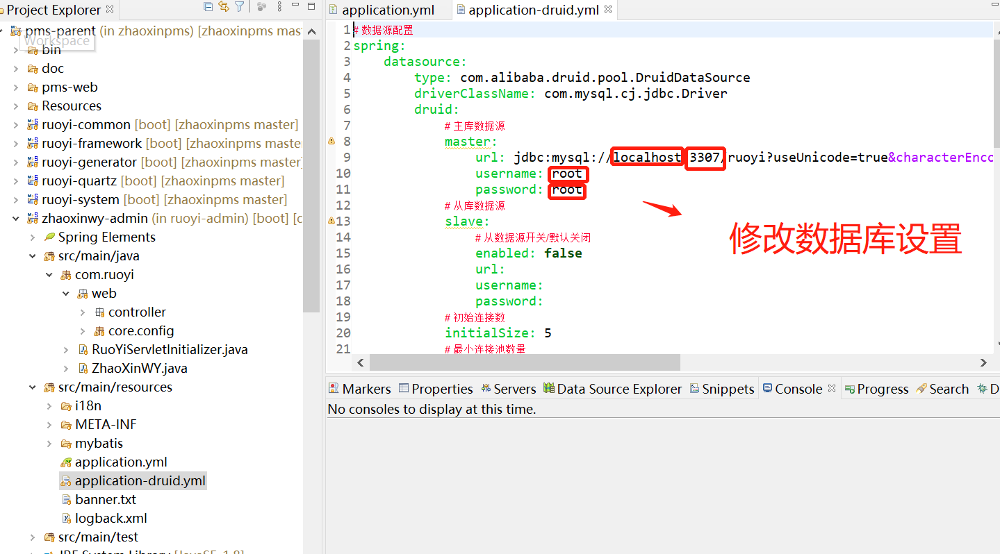

* zhaoxinwy-admin项目系统文件路径配置，编辑resource目录下的application.yml
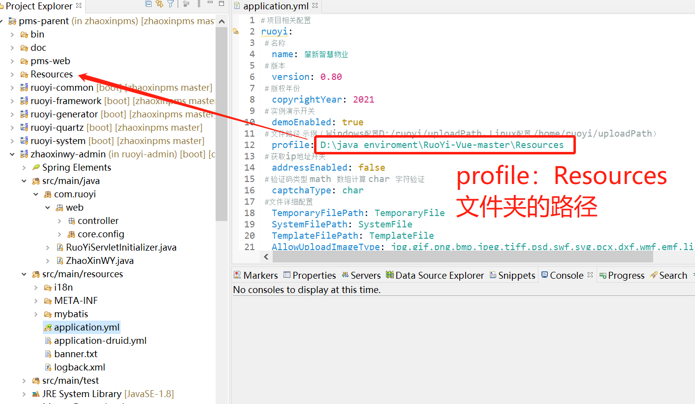

* zhaoxinwy-jmreport数据库配置，编辑resource下的application.yml
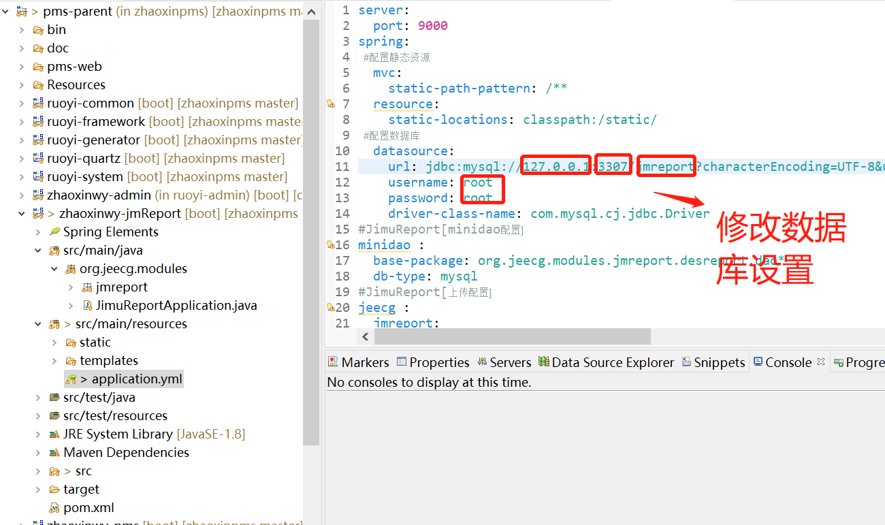

## 演示与文档

> 管理账号：admin / admin123
>
> 流程演示：
> 
> 作者这人较懒，未能提供多角色的账号体验。
> 
> 系统已内嵌支持多角色参与的复杂交互流程
> 
> 创建账号并分配角色即可演示功能

演示地址：https://zhaoxinms.com/demo.html#wuye

文档地址：http://zhaoxinms.com:81/

## 联系作者

:fa-wechat: 优化建议、问题反馈、协作开发、技术支持、咨询合作，请扫码联系作者
另承接各类软件研发项目，有需要的朋友请联系作者。

<p >

</p>


